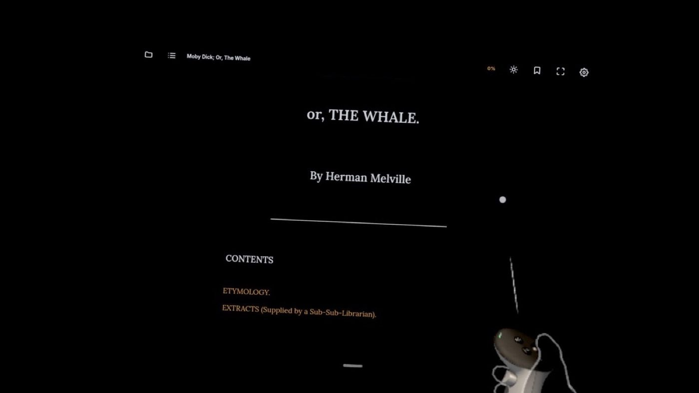
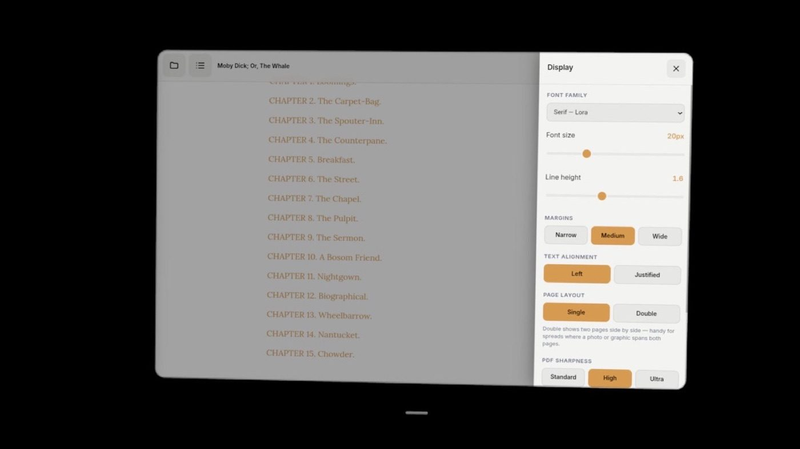
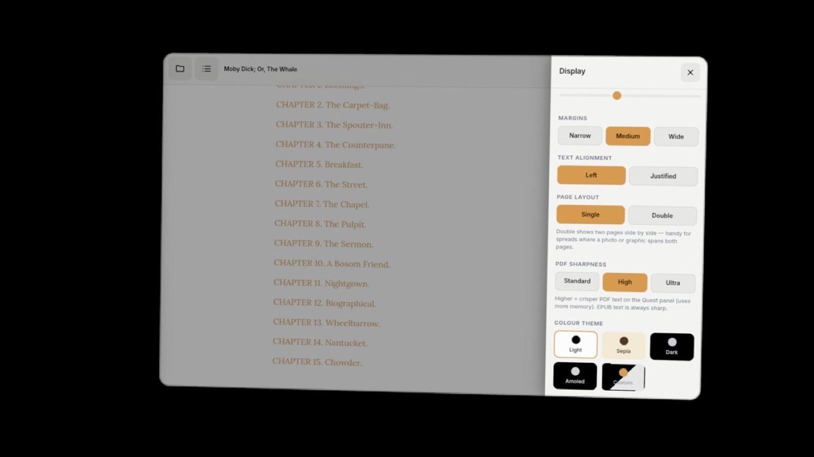

# VRReader: Immersive E-Book Reader for the Meta Quest Browser

A free, zero-install, zero-login **EPUB & PDF reader** built as a single-file
Progressive Web App, optimised for the Meta Quest 3 browser's floating panel.
Open your own books from local storage and read edge-to-edge. Nothing is ever
uploaded to a server.

## In action

Reading Moby Dick in the dark theme, straight from the headset:

Full typography control: font family, size, line height, margins, alignment and single or double page layout:

Five colour themes plus a custom colour picker, and adjustable PDF sharpness:

## Files

| File | Purpose |
|---|---|
| `vr-reader.html` | The entire app: HTML, CSS and vanilla JS in one file. No build step. |
| `index.html` | Redirect to `vr-reader.html` (so a bare folder URL works). |
| `manifest.webmanifest` | PWA manifest: installable, `standalone`, themed. |
| `sw.js` | Service worker: caches the app shell for offline use. |
| `icon.svg` | App icon (SVG, scalable, maskable). |

## Features

- **Local file import**: drag & drop or file picker. EPUB and PDF. Processed
  entirely in-browser; no cloud, no backend, no account.
- **EPUB** via [epub.js](https://github.com/futurepress/epub.js): true reflow
  with full control of font, size, line height, margins, alignment and colours.
- **PDF** via [pdf.js](https://mozilla.github.io/pdf.js/): page-by-page canvas
  rendering with a dark-mode `invert` filter for comfortable reading.
- **Real Fullscreen API** toolbar button (plus `F11`) that fills the Quest panel.
- **Quick light/dark toggle** in the toolbar, working in both formats.
- **Typography panel**: 5 font families (Lora, Inter, JetBrains Mono, Literata,
  OpenDyslexic), font size 14–36px, line height 1.2–2.2, 3 margin widths,
  left/justified alignment.
- **5 colour themes**: Light, Sepia, Dark, Amoled Black, and a Custom
  background/text colour picker.
- **Table of contents**, **in-memory bookmarks**, **progress indicator** and a
  thin chapter progress bar.
- **Focus mode**: tap the centre of the page to hide all UI; tap again to
  restore. The toolbar also auto-hides after 3 seconds of inactivity.
- **Navigation**: tap left/right edges, swipe, or use arrow keys / Space
  (Quest controller friendly). All touch targets are ≥ 44px.
- **No `localStorage`**: all session state lives in an in-memory `AppState`
  object (Quest browser sandbox blocks `localStorage`).

## Using it on the Quest 3

1. Host the `vrreader/` folder on any static host (Vercel, Netlify, GitHub
   Pages) over **HTTPS**, or just open `vr-reader.html` directly.
2. In the Quest browser, open the URL.
3. Open the browser menu and choose **Install / Add to Home Screen** to add
   VRReader to your Horizon home as a standalone PWA. After the first online
   visit the service worker caches the shell, so it also opens offline.
4. Tap the folder icon (or drag a file in) to open an EPUB or PDF and read.

> MOBI/AZW3 isn't supported. Convert to EPUB with the free
> [Calibre](https://calibre-ebook.com/) app first.

## Architecture notes

- **Single file, no bundler.** Libraries load from CDN (epub.js, pdf.js, JSZip);
  fonts from Google Fonts with system-font fallback.
- **All theming via CSS custom properties** on `:root` / `body[data-theme]`.
  Switching a theme just swaps variable values; EPUB iframe content is themed
  through epub.js's injected stylesheet.
- **PWA**: `manifest.webmanifest` + `sw.js`. The service worker uses cache-first
  for the same-origin shell and stale-while-revalidate for CDN assets, so the
  reader works offline after the first visit.
